---
## Front matter
title: "Отчёт по лабораторной работе №3"
subtitle: "Дисциплина: Архитектура компьютера"
author: "Бызова Мария Олеговна"

## Generic otions
lang: ru-RU
toc-title: "Содержание"

## Bibliography
bibliography: bib/cite.bib
csl: pandoc/csl/gost-r-7-0-5-2008-numeric.csl

## Pdf output format
toc: true # Table of contents
toc-depth: 2
lof: true # List of figures
lot: true # List of tables
fontsize: 12pt
linestretch: 1.5
papersize: a4
documentclass: scrreprt
## I18n polyglossia
polyglossia-lang:
  name: russian
  options:
	- spelling=modern
	- babelshorthands=true
polyglossia-otherlangs:
  name: english
## I18n babel
babel-lang: russian
babel-otherlangs: english
## Fonts
mainfont: PT Serif
romanfont: PT Serif
sansfont: PT Sans
monofont: PT Mono
mainfontoptions: Ligatures=TeX
romanfontoptions: Ligatures=TeX
sansfontoptions: Ligatures=TeX,Scale=MatchLowercase
monofontoptions: Scale=MatchLowercase,Scale=0.9
## Biblatex
biblatex: true
biblio-style: "gost-numeric"
biblatexoptions:
  - parentracker=true
  - backend=biber
  - hyperref=auto
  - language=auto
  - autolang=other*
  - citestyle=gost-numeric
## Pandoc-crossref LaTeX customization
figureTitle: "Рис."
tableTitle: "Таблица"
listingTitle: "Листинг"
lofTitle: "Список иллюстраций"
lotTitle: "Список таблиц"
lolTitle: "Листинги"
## Misc options
indent: true
header-includes:
  - \usepackage{indentfirst}
  - \usepackage{float} # keep figures where there are in the text
  - \floatplacement{figure}{H} # keep figures where there are in the text
---

# Цель работы

Целью данной лабораторной работы является освоение процедуры оформления отчетов с помощью легковесного языка разметки Markdown.

# Теоретическое введение

Markdown - легковесный язык разметки, созданный с целью обозначения форматирования в простом тексте, с максимальным сохранением его читаемости человеком, и пригодный для машинного преобразования в языки для продвинутых публикаций. Внутритекстовые формулы делаются аналогично формулам LaTeX. В Markdown вставить изображение в документ можно с помощью непосредственного указания адреса изображения. Синтаксис Markdown для встроенной ссылки состоит из части [link text], представляющей текст гиперссылки, и части (file-name.md) – URL-адреса или имени файла, на который дается ссылка. Markdown поддерживает как встраивание фрагментов кода в предложение, так и их размещение между предложениями в виде отдельных огражденных блоков. Огражденные блоки кода — это простой способ выделить синтаксис для фрагментов кода.

# Выполнение лабораторной работы

Для выполнения последующих заданий данной лабораторной работы открываем терминал и переходим в каталог курса, сформированный в ходе предыдущей лабораторной работы (рис. [-@fig:001])

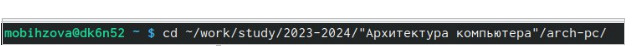{#fig:001 width=70%}

Далее обновляем локальный репозиторий, скачав изменения из удаленного репозитория с помощью команды git pull (рис. [-@fig:002]).

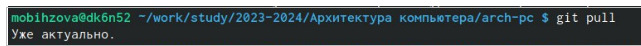{#fig:002 width=70%}

Далее переходим в каталог с шаблоном отчета по лабораторной работе № 3, созданный в ходе предыдущей лабораторной работы. (рис. [-fig:003])

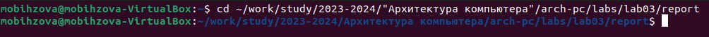{#fig:003 width=70%}

Компилируем шаблон с использованием Makefile, вводя команду make (рис. [-@fig:004]). Должны успешно сгенерироваться файлы report.pdf и report.docx. Откроем и проверим корректность полученных файлов (рис. [-@fig:005],[-@fig:006], [-@fig:007], [-@fig:008]).

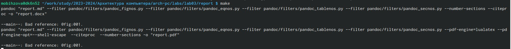{#fig:004 width=70%}

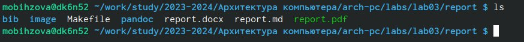{#fig:005 width=70%}

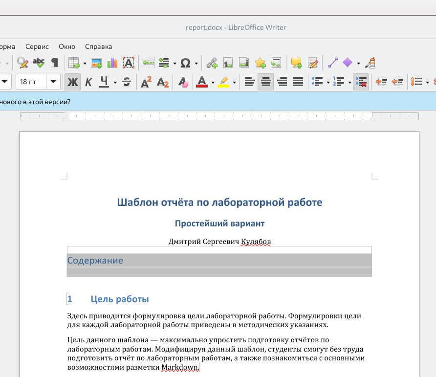{#fig:006 width=70%}

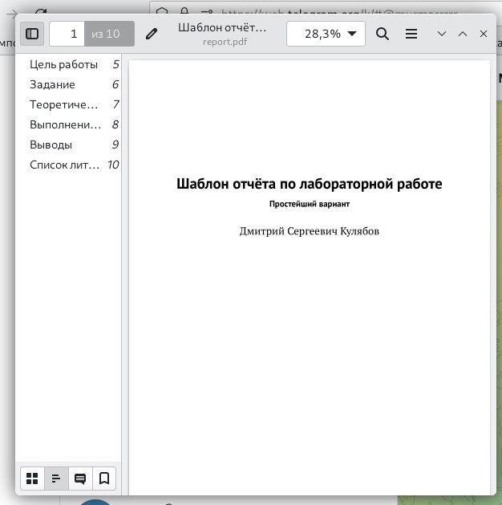{#fig:007 width=70%}

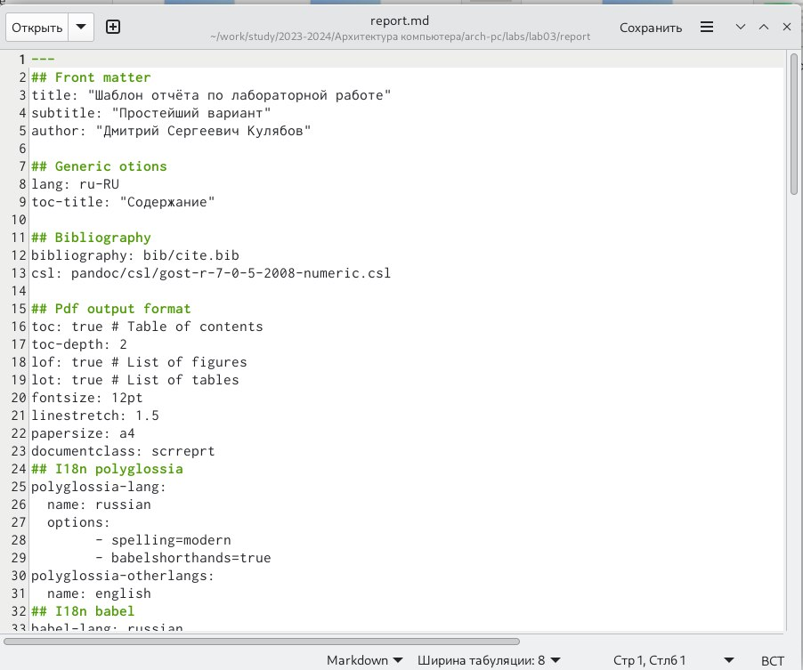{#fig:008 width=70%}

Удаляем полученные файлы с использованием Makefile, вводя команду make clean (рис. [-@fig:009]). С помощью команды ls проверим, удалились ли созданные файлы (рис. [-@fig:010])

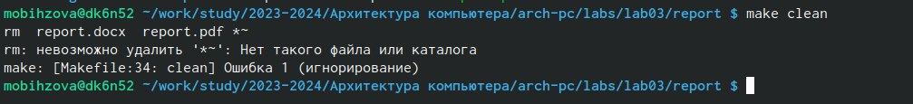{#fig:009 width=70%}

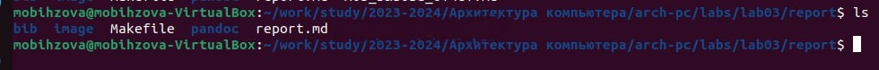{#fig:010 width=70%}

Теперь откроем файл report.md c помощью любого текстового редактора, например gedit (рис. [-@fig:011])

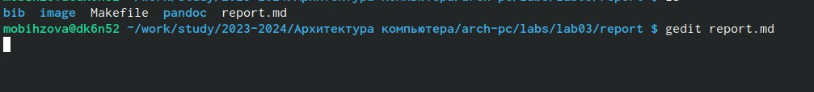{#fig:011 width=70%}

Внимательно изучив структуру данного файла приступаем к заполнению отчёта по данной лабораторной работе с помощью языка разметки Markdown (рис. [-@fig:012]).

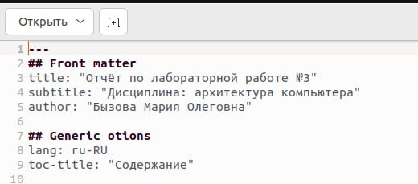{#fig:012 width=70%}

После завершения заполнения отчёта по данной лабораторной работе с помощью языка разметки Markdown загружаем все созданные файла на Github: добавляем изменения на GitHub с помощью комнадой git add и сохраняем изменения с помощью commit, отправляляем файлы на сервер с помощью команды git push (рис. [-@fig:013]).

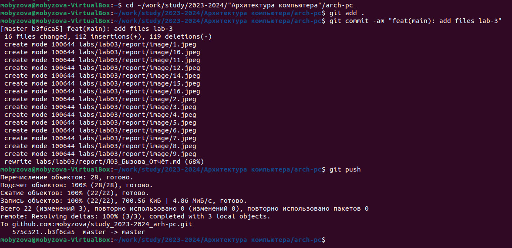{#fig:013 width=70%}

# Описание результатов выполнения заданий для самостоятельной работы

Перейдя в необходимый каталог, создаём файл для отчёта по лабораторной работе №2 в формате Markdown и присутпаем к его заполнению (рис. [-@fig:014]?, [-@fig:015]) 

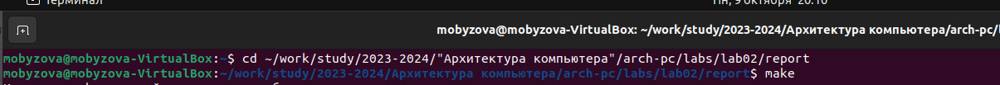{#fig:014 width=70%}

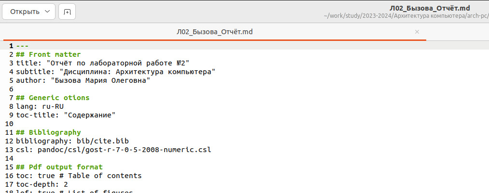{#fig:015 width=70%}

После завершения заполнения отчёта загружаем все файлы на Github: добавляем изменения на GitHub с помощью комнадой git add и сохраняем изменения с помощью commit, отправляляем файлы на сервер с помощью команды git push (рис.[-@fig:016]).

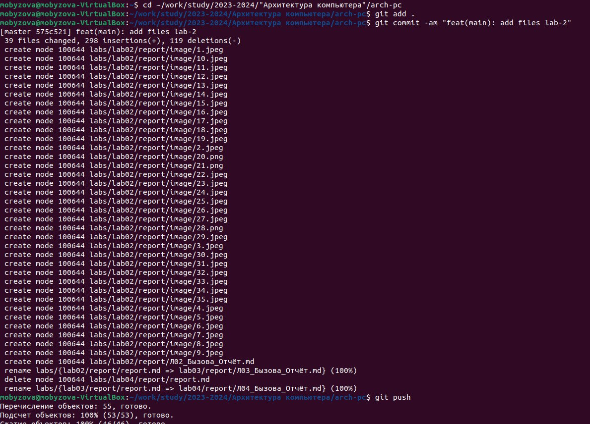{#fig:016 width=70%}

# Выводы

В результате выполнения данной лабораторной работы были освоены процедуры оформления отчетов с помощью легковесного языка разметки Markdown.

